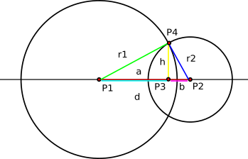

# Определение координат пересечения окружностей на изображении

Даниил Шерки

## Как работать

Весь алгоритм находится в файле ```algorithm.py```.

Проверить работу алгоритму можно через notebook ```example.ipynb``` либо через файл ```main.py``` с помощью командной строки.

Прочитать про аргументы можно с помощью

```bash
python main.py --help
```
Используя параметры по умолчанию 

```bash
python main.py путь_до_файла
```

Или используя настроечные

```bash
python main.py  путь_до_файла --dp .. --minDist .. --params .. .. --radius_limits .. .. --visualize
```

Установить все необходимые библиотеки 

```bash
pip -r requirements.txt
```

Описание аргументов алгоритма можно найти ниже.

## Постановка задачи

### Условие

Дано изображение сплошного круга на белом фоне, из которого вырезали сегменты также формы кругов.
Вырезанных кругов ровно 3, они не пересекаются, кратчайшее расстояние между ними не менее 20% радиуса серой окружности, а их центры лежат внутри исходного серого круга, однако они не вложены полностью в серый круг.  Радиус вырезанных кругов не менее 5% и не более 30% от большого серого круга (все ограничения не строгие, нужны для избежания вырожденных случаев, упрощают решение).


### Задание

Реализовать и описать алгоритм поиска координат точек на “сломе”, где граничат серая окружность, границы вырезанных кругов и внешней области.

#### Формат входных данных: 
png файл, 1024х1024х3. Бинарное изображение, фон – чёрный (0, 0, 0), фигура – белого цвета (255, 255, 255). 

#### Вывод: 
Список координат найденных 6 вершин на изображении. 
Также требуется объяснить и обосновать решение в форме неформальной записки.

## Интуиция

Кажется, что для такой просто задачи не нужно использовать методы Deep Learning. Достаточно будет классических методов компьютерного зрения.

Самым простым и в то же время эффективным кажется вариант, когда:
 - происходит детекция окружностей на изображении (определение координат их центров + величину радиусов);
 - аналитическое вычисление точек их пересечения.

## Решение

### Алгоритм нахождения кругов

Метод обнаружения окружностей Хофа (**Hough Circle Transform**). Он основан на преобразовании Хофа, которое позволяет обнаруживать геометрические фигуры на изображении.

Оно основано на том, что каждая геометрическая фигура может быть представлена в виде математического уравнения. Окружность можно представить так:

$$ (x - a)^2 + (y - b)^2 = r^2 $$
где $(a, b)$ - координаты центра окружности, а $r$ - радиус
.
Преобразование Хофа преобразует изображение в пространство параметров $(a, b, r)$, где каждая точка представляет собой возможную окружность на изображении

В реализации этого алгоритма в Open-cv используется градиентный метод Хофа (**Hough Gradient Method**), который использует информацию о градиенте (краеях).

Управляющие параметры алгоритма (см. [документацию open-cv](https://docs.opencv.org/3.4/dd/d1a/group__imgproc__feature.html#ga47849c3be0d0406ad3ca45db65a25d2d)):

 - **dp**:	Обратное отношение разрешения аккумулятора к разрешению изображения. Например, если dp=1, то разрешение аккумулятора равно разрешению входного изображения. Если dp=2, то ширина и высота аккумулятора в два раза меньше.
- **minDist**: Минимальное расстояние между центрами обнаруженных окружностей. Если параметр слишком мал, то в дополнение к истинной окружности могут быть ложно обнаружены несколько соседних окружностей. Если параметр слишком велик, некоторые окружности могут быть пропущены.
- **param1**: Первый специфический для метода параметр. В случае HOUGH_GRADIENT это больший порог из двух, передаваемых детектору краев Canny (меньший порог в два раза меньше).
- **param2**: Второй специфический параметр метода. В случае HOUGH_GRADIENT это порог накопления для центров окружностей на этапе обнаружения. Чем он меньше, тем больше ложных окружностей может быть обнаружено. Круги, соответствующие большим значениям аккумулятора, будут возвращены первыми.
- **minRadius**: Минимальный радиус окружности.
- **maxRadius**	Максимальный радиус окружности. Если <= 0, используется максимальный размер изображения. Если < 0, возвращает центры без определения радиуса.

В результате грамотного подбора параметров получаем такое изображение:


### Вычисление пересечения окружностей



[источник](https://planetcalc.ru/8098/)

Зная координаты центров и радиусы окружностей, можем получить найти точки пересечения аналитически.

Алгоритм в основном выводится из теоремы Пифагора.

Сначала векторно находится расстояние между центрами $P_1$ и $P_2$ - $d(P_1, P_2)$.

Затем вычисляем отрезок
$$ a = \dfrac{r^2_1 - r^2_2 + d^2}{2d}$$

и отрезок 
$$ h = \sqrt{r^2_1 - a^2}$$

Также в векорной форме можно найти точку $P_3$
$$P_3 = P_1 + \frac{a}{d}(P_2 - P_1)$$

Тогда ервая точка:
$$x_4 = x_3 + \frac{h}{d}(y_2 - y_1)$$
$$y_4 = y_3 - \frac{h}{d} (x_2 - x_1)$$

И вторая точка:
$$x_5 = x_3 - \frac{h}{d}(y_2 - y_1)$$
$$y_5 = y_3 + \frac{h}{d} (x_2 - x_1)$$

Далее просто возвращаем $[(x_4, y_4), (x_5, y_5)]$.

С каждой из окружностей, которое не является основным (внешним) нужно проделать попарное сравнение с основной окружностью. Таким образом мы получим все шесть вершин сломов.

## Результаты


Время выполнения алгоритма без визуализации в среднем 106 ms, на Macbook Air M1.


Таблица с результатами:

| **x** | **y** |
|----|----|
| 842.61 | 842.72 |
| 723.58| 928.65 |
| 91.36 | 281.82 |
| 153.13 | 192.90 |
| 805.32| 136.04 |
| 873.29 | 202.73 |

## Сложности

Если параметры алгоритма настроены неправильно, может быть найдено больше 4 окружности, радиусов больше или меньше остальной.

Что с этим можно сделать:

- проверки на размер радиуса самой большой окружности (меньше *512*);
- первичная проверка на пересечение с основной окружностью (*сделано*).